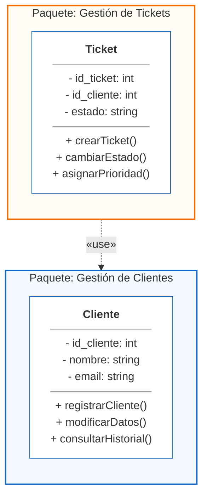

```mermaid
flowchart TB
    %% Configuración de Estilos Visuales
    classDef packStyle fill:#fafafa,stroke:#333,stroke-width:2px,stroke-dasharray: 5 5;
    classDef classStyle fill:#ffffff,stroke:#1565c0,stroke-width:1px;

    %% Paquete Gestión de Clientes
    subgraph ClientePack ["Paquete: Gestión de Clientes"]
        direction TB
        Cliente["<b>Cliente</b><hr/>- id_cliente: int<br/>- nombre: string<br/>- email: string<hr/>+ registrarCliente()<br/>+ modificarDatos()<br/>+ consultarHistorial()"]
    end
    style ClientePack fill:#f4f9ff,stroke:#1565c0,stroke-width:2px;

    %% Paquete Gestión de Tickets
    subgraph TicketPack ["Paquete: Gestión de Tickets"]
        direction TB
        Ticket["<b>Ticket</b><hr/>- id_ticket: int<br/>- id_cliente: int<br/>- estado: string<hr/>+ crearTicket()<br/>+ cambiarEstado()<br/>+ asignarPrioridad()"]
    end
    style TicketPack fill:#fffbf5,stroke:#ef6c00,stroke-width:2px;

    %% Aplicación de estilos a los nodos internos
    class Cliente,Ticket classStyle;

    %% Relación de dependencia entre paquetes UML
    TicketPack -. «use» .-> ClientePack
```
