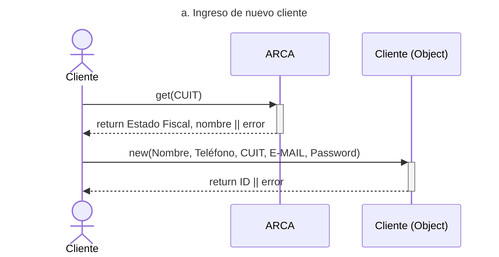
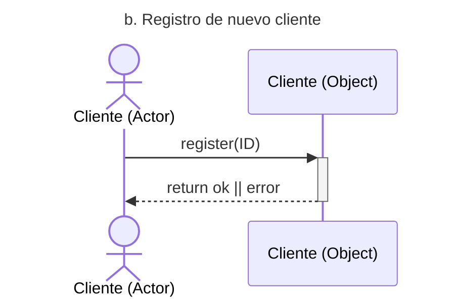
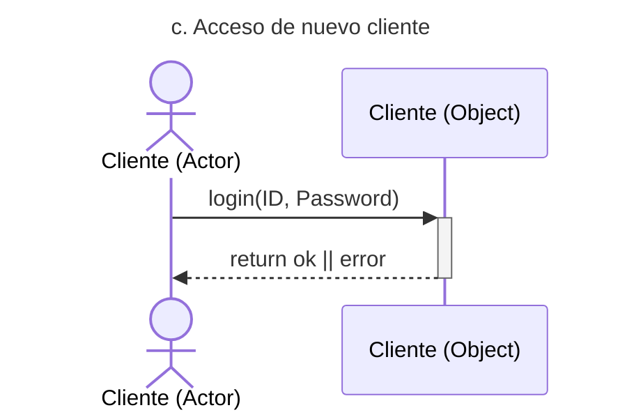
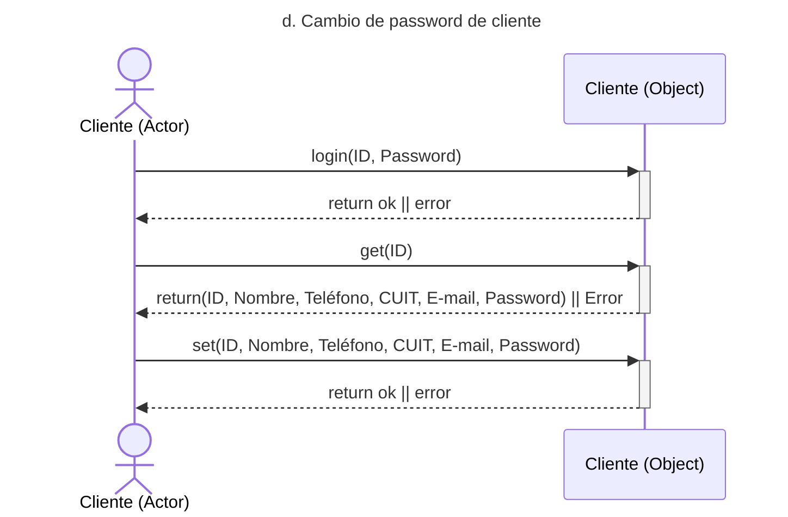
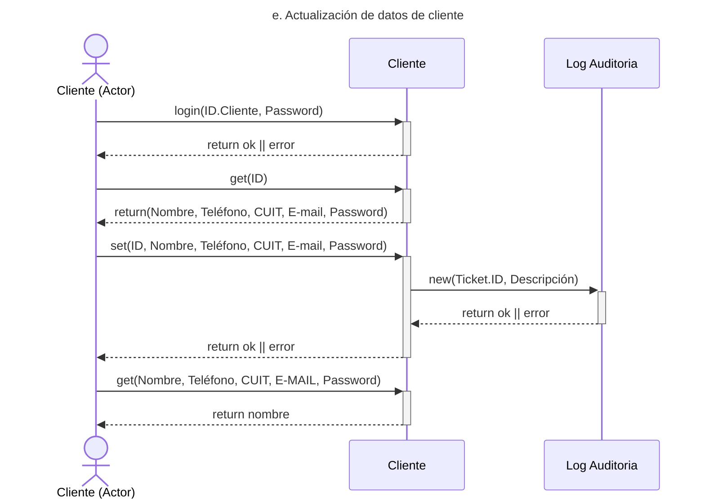
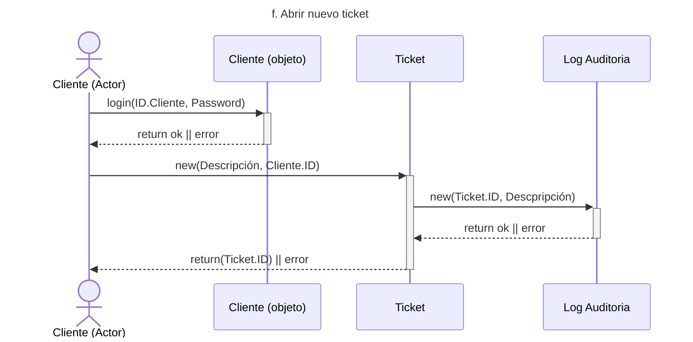
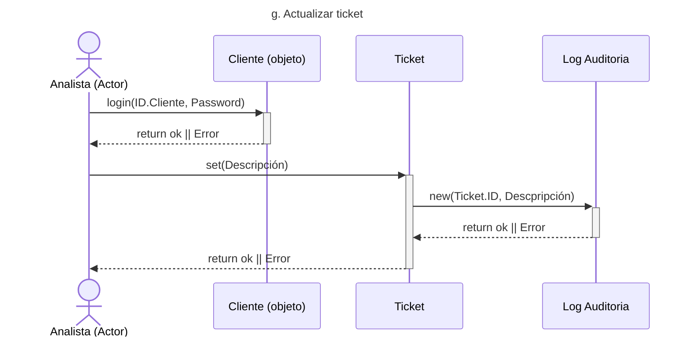
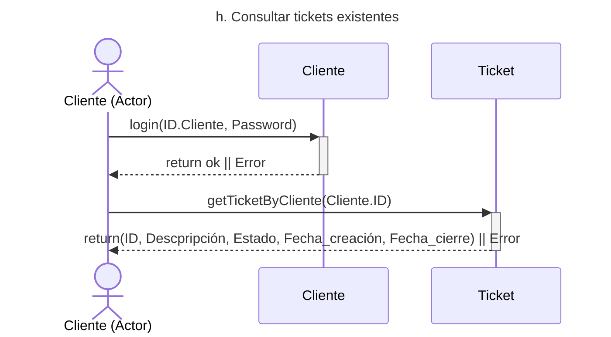
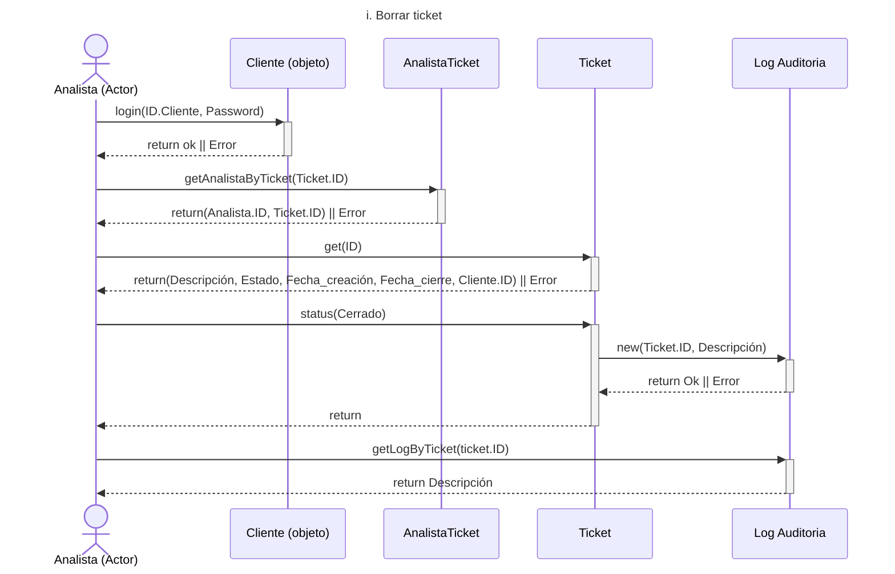

# Diagramas de secuencia

## a. Ingreso de nuevo cliente

## b. Registro de nuevo cliente

## c. Acceso de nuevo cliente

## d. Cambio de password de cliente

## e. Actualización de datos de cliente

## f. Abrir nuevo ticket

## g. Actualizar ticket

## h. Consultar tickets existentes

## i. Borrar ticket

