# Diagramas UML TP6

## Diagramas de secuencia TP6 - ejercicio 1
### a. Ingreso de nuevo cliente

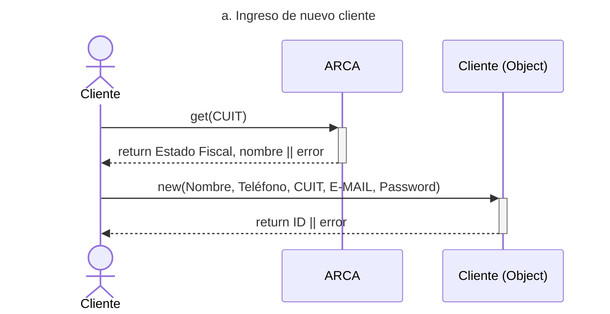
```mermaid
sequenceDiagram
    title a. Ingreso de nuevo cliente

    actor ca as Cliente
    participant a as ARCA
    participant co as Cliente (Object)

    ca->>+a: get(CUIT)
    a-->>-ca: return Estado Fiscal, nombre || error
    ca->>+co: new(Nombre, Teléfono, CUIT, E-MAIL, Password)
    co-->>-ca: return ID || error
```

## b. Registro de nuevo cliente

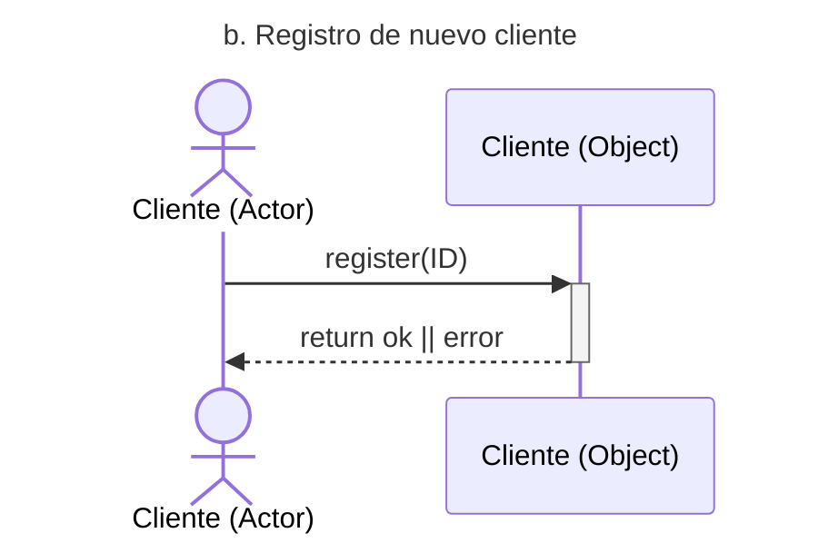
```mermaid
sequenceDiagram
    title b. Registro de nuevo cliente

    actor ca as Cliente (Actor)
    participant co as Cliente (Object)

    ca->>+co: register(ID)
    co-->>-ca: return ok || error
```

## c. Acceso de nuevo cliente

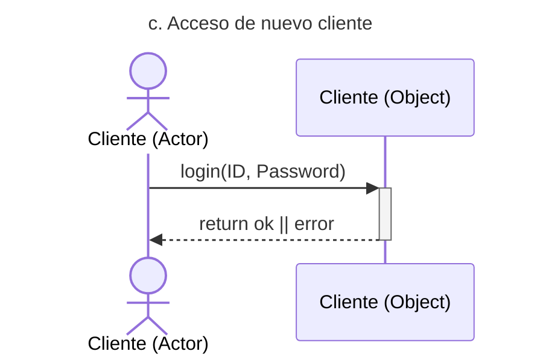
```mermaid
sequenceDiagram
    title c. Acceso de nuevo cliente

    actor ca as Cliente (Actor)
    participant co as Cliente (Object)

    ca->>+co: login(ID, Password)
    co-->>-ca: return ok || error
```

## d. Cambio de password de cliente

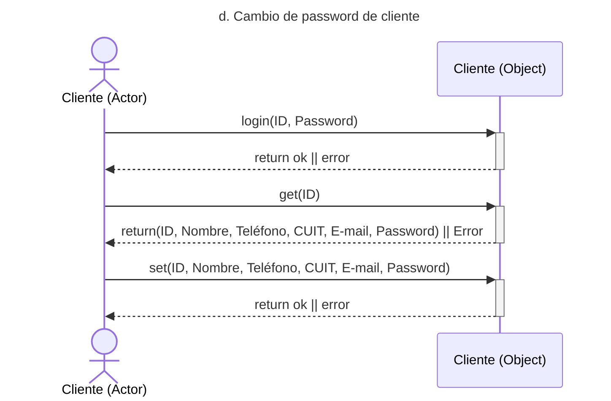
```mermaid
sequenceDiagram
    title d. Cambio de password de cliente

    actor ca as Cliente (Actor)
    participant co as Cliente (Object)

    ca->>+co: login(ID, Password)
    co-->>-ca: return ok || error

    ca->>+co: get(ID)
    co-->>-ca: return(ID, Nombre, Teléfono, CUIT, E-mail, Password) || Error

    ca->>+co: set(ID, Nombre, Teléfono, CUIT, E-mail, Password)
    co-->>-ca: return ok || error
```

## e. Actualización de datos de cliente

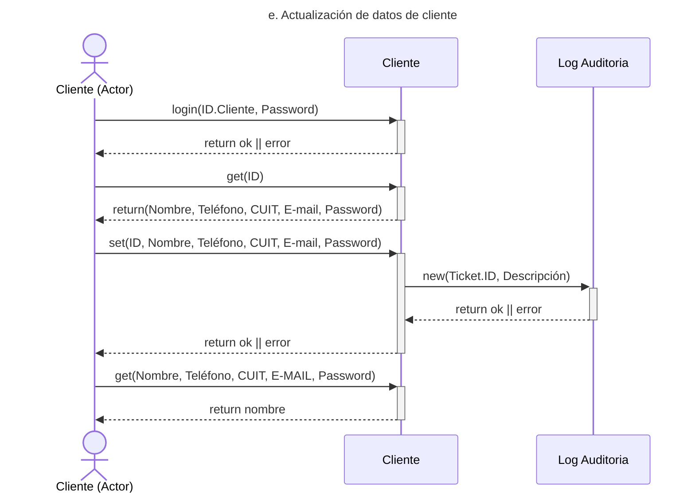
```mermaid
sequenceDiagram
    title e. Actualización de datos de cliente

    actor ca as Cliente (Actor)
    participant c as Cliente
    participant l as Log Auditoria

    ca->>+c: login(ID.Cliente, Password)
    c-->>-ca: return ok || error

    ca->>+c: get(ID)
    c-->>-ca: return(Nombre, Teléfono, CUIT, E-mail, Password)

    ca->>+c: set(ID, Nombre, Teléfono, CUIT, E-mail, Password)
    c->>+l: new(Ticket.ID, Descripción)
    l-->>-c: return ok || error
    c-->>-ca: return ok || error

    ca->>+c: get(Nombre, Teléfono, CUIT, E-MAIL, Password)
    c-->>-ca: return nombre
```

## f. Abrir nuevo ticket

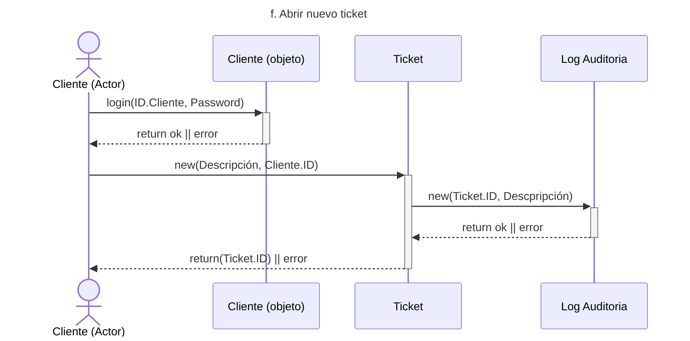
```mermaid
sequenceDiagram
    title f. Abrir nuevo ticket

    actor ca as Cliente (Actor)
    participant co as Cliente (objeto)
    participant t as Ticket
    participant l as Log Auditoria

    ca->>+co: login(ID.Cliente, Password)
    co-->>-ca: return ok || error

    ca->>+t: new(Descripción, Cliente.ID)
    t->>+l: new(Ticket.ID, Descpripción)
    l-->>-t: return ok || error
    t-->>-ca: return(Ticket.ID) || error
```

## g. Actualizar ticket

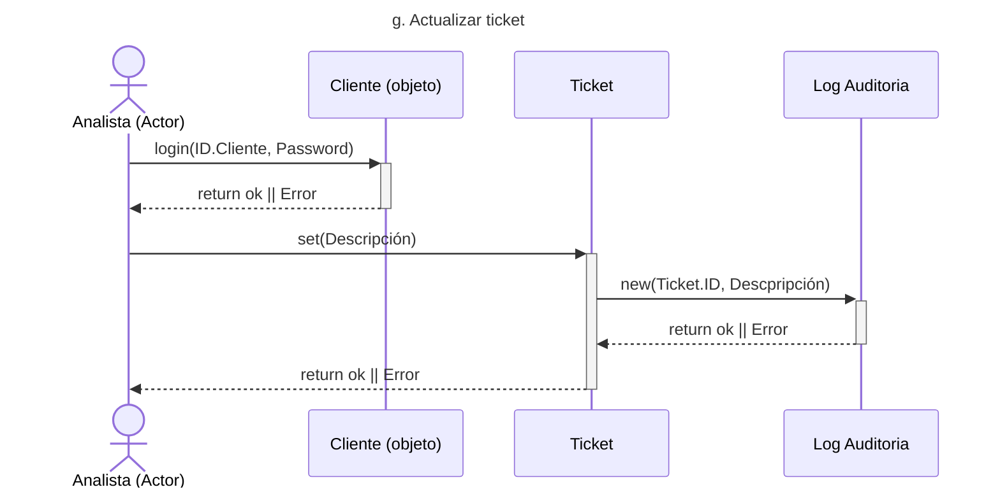
```mermaid
sequenceDiagram
    title g. Actualizar ticket

    actor a as Analista (Actor)
    participant co as Cliente (objeto)
    participant t as Ticket
    participant l as Log Auditoria

    a->>+co: login(ID.Cliente, Password)
    co-->>-a: return ok || Error

    a->>+t: set(Descripción)
    t->>+l: new(Ticket.ID, Descpripción)
    l-->>-t: return ok || Error
    t-->>-a: return ok || Error
```

## h. Consultar tickets existentes

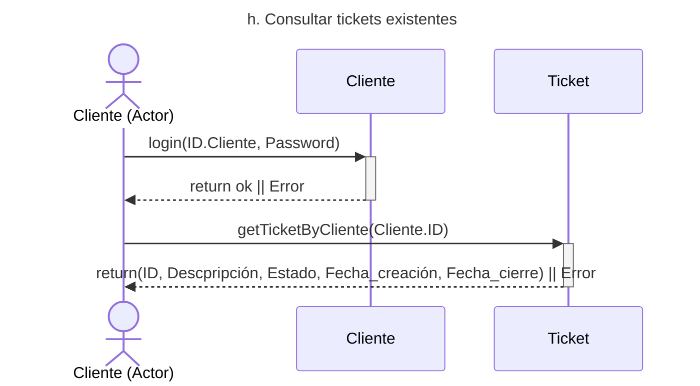
```mermaid
sequenceDiagram
    title h. Consultar tickets existentes

    actor ca as Cliente (Actor)
    participant co as Cliente
    participant t as Ticket

    ca->>+co: login(ID.Cliente, Password)
    co-->>-ca: return ok || Error

    ca->>+t: getTicketByCliente(Cliente.ID)
    t-->>-ca: return(ID, Descpripción, Estado, Fecha_creación, Fecha_cierre) || Error
```

## i. Borrar ticket

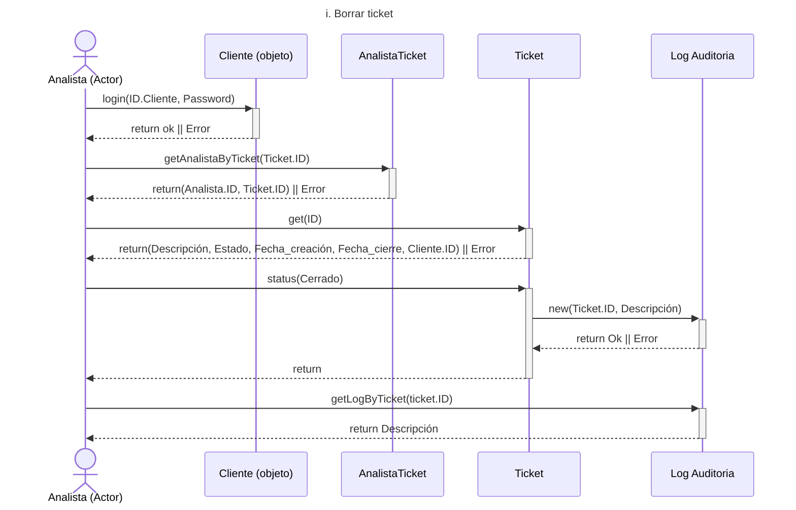
```mermaid
sequenceDiagram
    title i. Borrar ticket

    actor a as Analista (Actor)
    participant co as Cliente (objeto)
    participant at as AnalistaTicket
    participant t as Ticket
    participant l as Log Auditoria

    a->>+co: login(ID.Cliente, Password)
    co-->>-a: return ok || Error

    a->>+at: getAnalistaByTicket(Ticket.ID)
    at-->>-a: return(Analista.ID, Ticket.ID) || Error

    a->>+t: get(ID)
    t-->>-a: return(Descripción, Estado, Fecha_creación, Fecha_cierre, Cliente.ID) || Error

    a->>+t: status(Cerrado)
    t->>+l: new(Ticket.ID, Descripción)
    l-->>-t: return Ok || Error
    t-->>-a: return

    a->>+l: getLogByTicket(ticket.ID)
    l-->>-a: return Descripción
```

## Ejercicio 2

### a. Ingreso de nuevo cliente

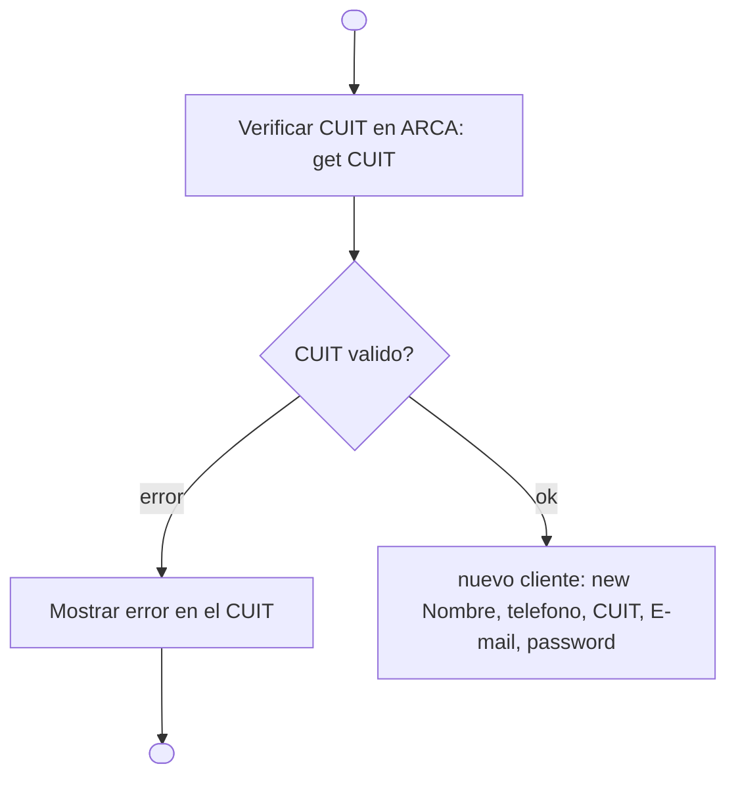
```mermaid

graph TD
    A([ ]) --> B[Verificar CUIT en ARCA: get CUIT]
    B --> C{CUIT valido?}
    C -- error --> D[Mostrar error en el CUIT] --> E([ ])
    C -- ok --> F[nuevo cliente: new Nombre, telefono, CUIT, E-mail, password]

```

### b. registro nuevo cliente
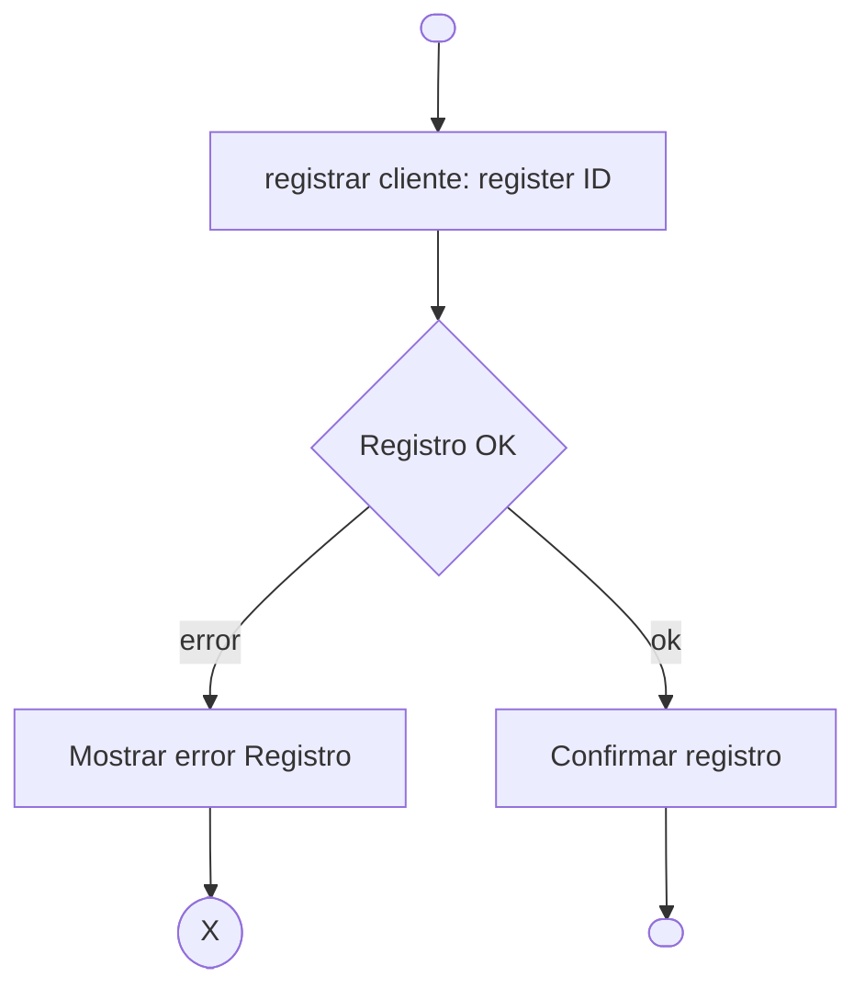
```mermaid

graph TD
    A([ ]) --> B[registrar cliente: register ID]
    B --> C{Registro OK}
    C -- error --> D[Mostrar error Registro] --> E([X])
    C -- ok --> F[Confirmar registro] --> G([ ])
```

### c. acceso de nuevo cliente
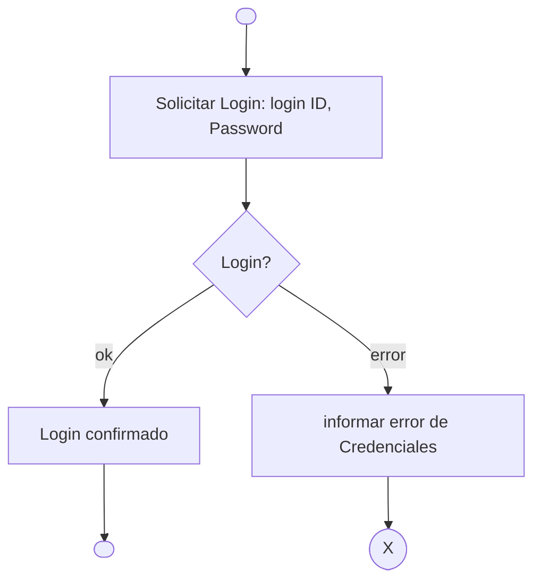
```mermaid

graph TD
    A([ ]) --> B[Solicitar Login: login ID, Password]
    B --> C{Login?}
    C -- ok --> D[Login confirmado] --> E([ ])
    C -- error --> F[informar error de Credenciales] --> G([X])

```

### d. cambio de password de cliente
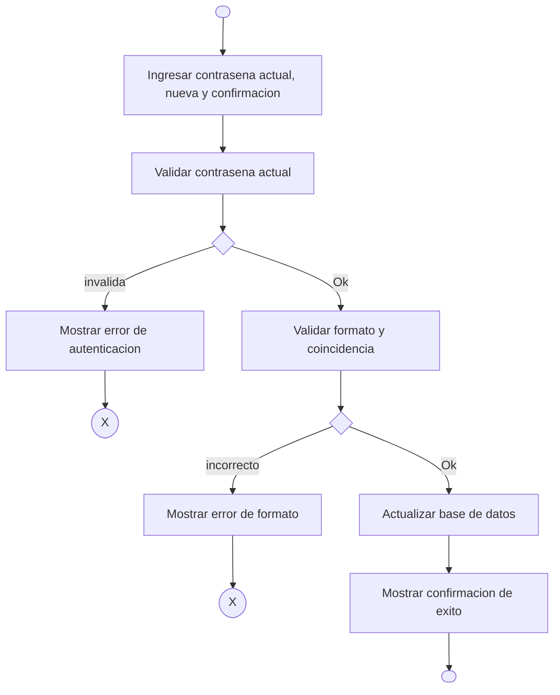
```mermaid

graph TD
    A([ ]) --> B[Ingresar contrasena actual, nueva y confirmacion]
    B --> C[Validar contrasena actual]
    C --> D{ }
    D -- invalida --> E[Mostrar error de autenticacion] --> F([X])
    D -- Ok --> G[Validar formato y coincidencia]
    G --> H{ }
    H -- incorrecto --> I[Mostrar error de formato] --> J([X])
    H -- Ok --> K[Actualizar base de datos]
    K --> L[Mostrar confirmacion de exito] --> M([ ])

```
## e. Actualización de datos de cliente
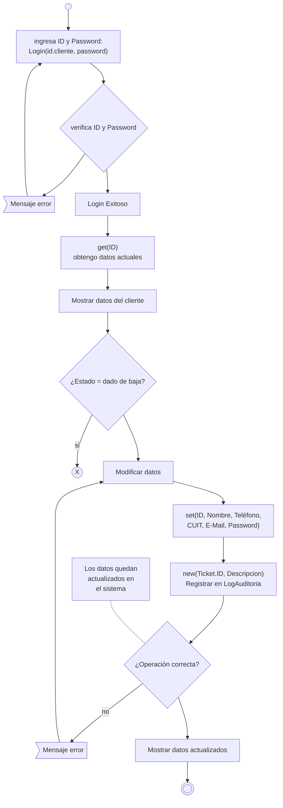
```mermaid
flowchart TD
    Start(( )) --> A["ingresa ID y Password:\nLogin(id.cliente, password)"]
    A --> B{"verifica ID y Password"}
    
    B --> C>"Mensaje error"]
    C --> A
    
    B --> D["Login Exitoso"]
    D --> E["get(ID)\nobtengo datos actuales"]
    E --> F["Mostrar datos del cliente"]
    F --> G{"¿Estado = dado de baja?"}
    
    G -- "si" --> H(("X"))
    
    G --> I["Modificar datos"]
    I --> J["set(ID, Nombre, Teléfono,\nCUIT, E-Mail, Password)"]
    J --> K["new(Ticket.ID, Descripcion)\nRegistrar en LogAuditoria"]
    K --> L{"¿Operación correcta?"}
    
    L -- "no" --> M>"Mensaje error"]
    M --> I
    
    L --> N["Mostrar datos actualizados"]
    N --> End((( )))

    Nota["Los datos quedan\nactualizados en\nel sistema"] -.- L
```

## f. Abrir nuevo ticket
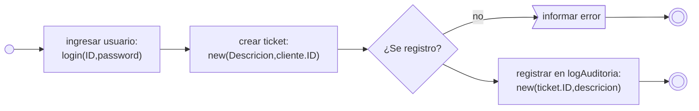
```mermaid
flowchart LR
    Start(( )) --> A["ingresar usuario:\nlogin(ID,password)"]
    A --> B["crear ticket:\nnew(Descricion,cliente.ID)"]
    B --> C{"¿Se registro?"}
    
    C -- "no" --> D>"informar error"]
    D --> End1((( )))
    
    C --> E["registrar en logAuditoria:\nnew(ticket.ID,descricion)"]
    E --> End2((( )))
```

## g. Actualizar ticket
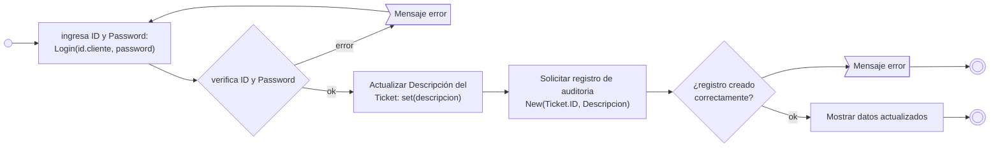
```mermaid
flowchart LR
    Start(( )) --> A["ingresa ID y Password:\nLogin(id.cliente, password)"]
    A --> B{"verifica ID y Password"}
    
    B -- "error" --> C>"Mensaje error"]
    C --> A
    
    B -- "ok" --> D["Actualizar Descripción del\nTicket: set(descripcion)"]
    D --> E["Solicitar registro de auditoria\nNew(Ticket.ID, Descripcion)"]
    E --> F{"¿registro creado\ncorrectamente?"}
    
    F --> G>"Mensaje error"]
    G --> End1((( )))
    
    F -- "ok" --> H["Mostrar datos actualizados"]
    H --> End2((( )))
```

## h. Consultar tickets existentes
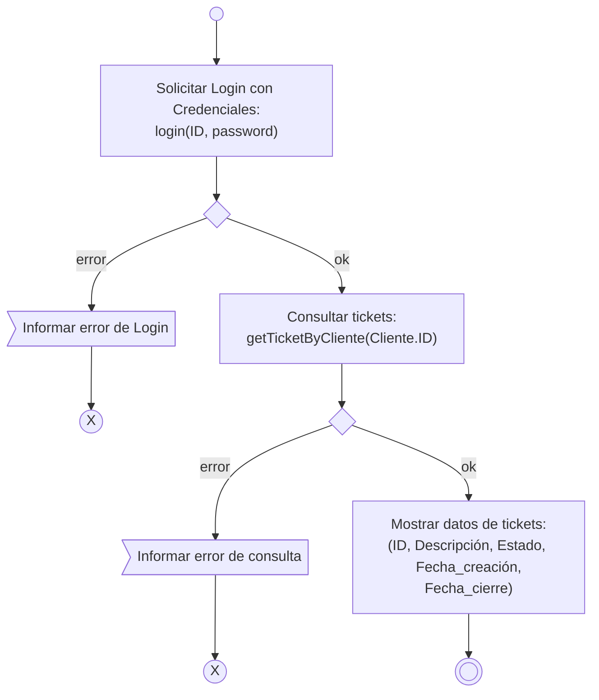
```mermaid
flowchart TD
    Start(( )) --> A["Solicitar Login con Credenciales:\nlogin(ID, password)"]
    A --> B{" "}
    
    B -- "error" --> C>"Informar error de Login"]
    C --> X1(("X"))
    
    B -- "ok" --> D["Consultar tickets:\ngetTicketByCliente(Cliente.ID)"]
    D --> E{" "}
    
    E -- "error" --> F>"Informar error de consulta"]
    F --> X2(("X"))
    
    E -- "ok" --> G["Mostrar datos de tickets:\n(ID, Descripción, Estado, Fecha_creación,\nFecha_cierre)"]
    G --> End((( )))
```

## i. Borrar ticket
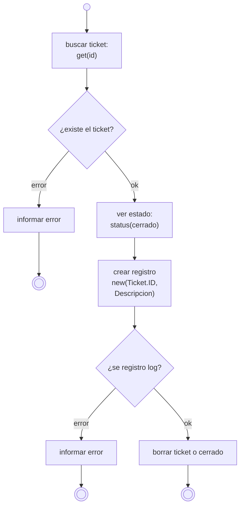
```mermaid
flowchart TD
    Start(( )) --> A["buscar ticket:\nget(id)"]
    A --> B{"¿existe el ticket?"}
    
    B -- "error" --> C["informar error"]
    C --> End1((( )))
    
    B -- "ok" --> D["ver estado:\nstatus(cerrado)"]
    D --> E["crear registro\nnew(Ticket.ID,\nDescripcion)"]
    E --> F{"¿se registro log?"}
    
    F -- "error" --> G["informar error"]
    G --> End2((( )))
    
    F -- "ok" --> H["borrar ticket o cerrado"]
    H --> End3((( )))
```

## Ejercicio 3
## Diagrama de estados de un cliente
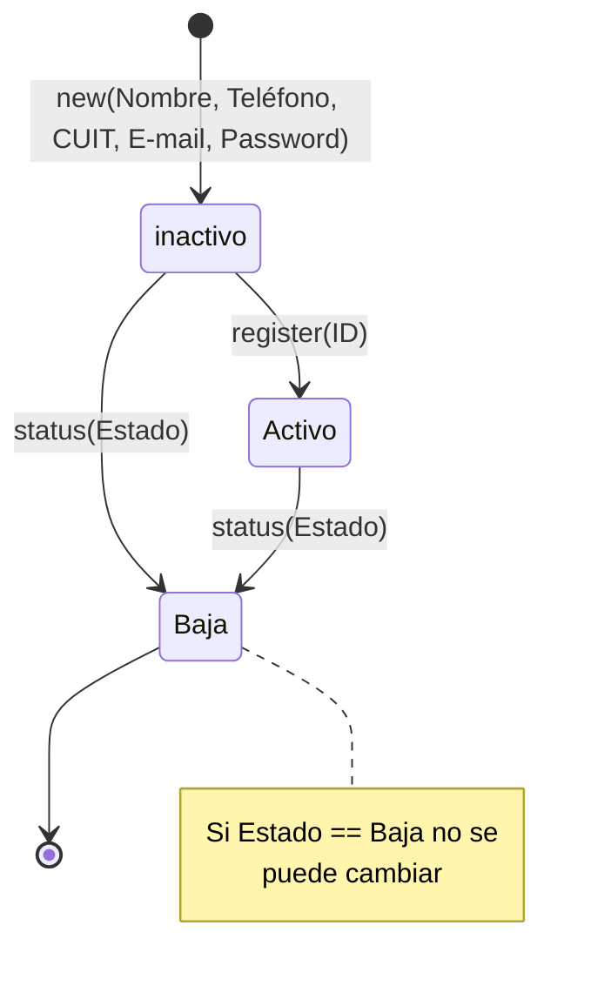
```mermaid
stateDiagram-v2
    [*] --> inactivo : new(Nombre, Teléfono, CUIT, E-mail, Password)
    inactivo --> Activo : register(ID)
    inactivo --> Baja : status(Estado)
    Activo --> Baja : status(Estado)
    Baja --> [*]

    note right of Baja
        Si Estado == Baja no se
        puede cambiar
    end note
```

## Ejercicio 4
## 4. Diagrama de estados de un tickect
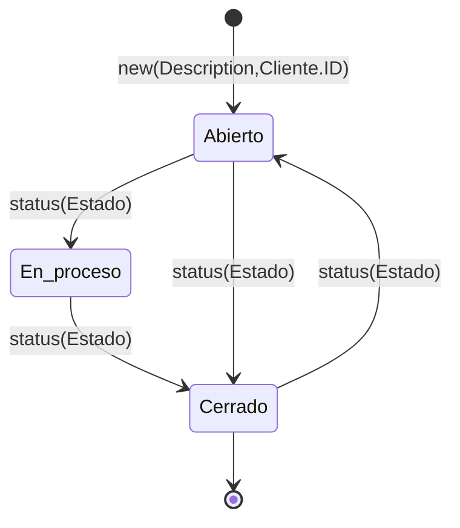
```mermaid

stateDiagram-v2
    [*] --> Abierto: new(Description,Cliente.ID)
    
    Abierto --> En_proceso: status(Estado)
    En_proceso --> Cerrado: status(Estado)
    
    Abierto --> Cerrado: status(Estado)
    Cerrado --> Abierto: status(Estado)
    
    Cerrado --> [*]

```

