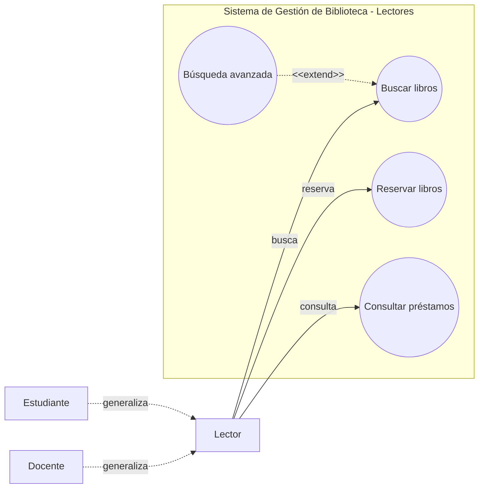
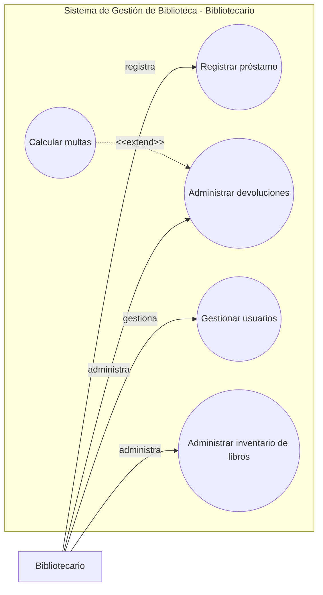
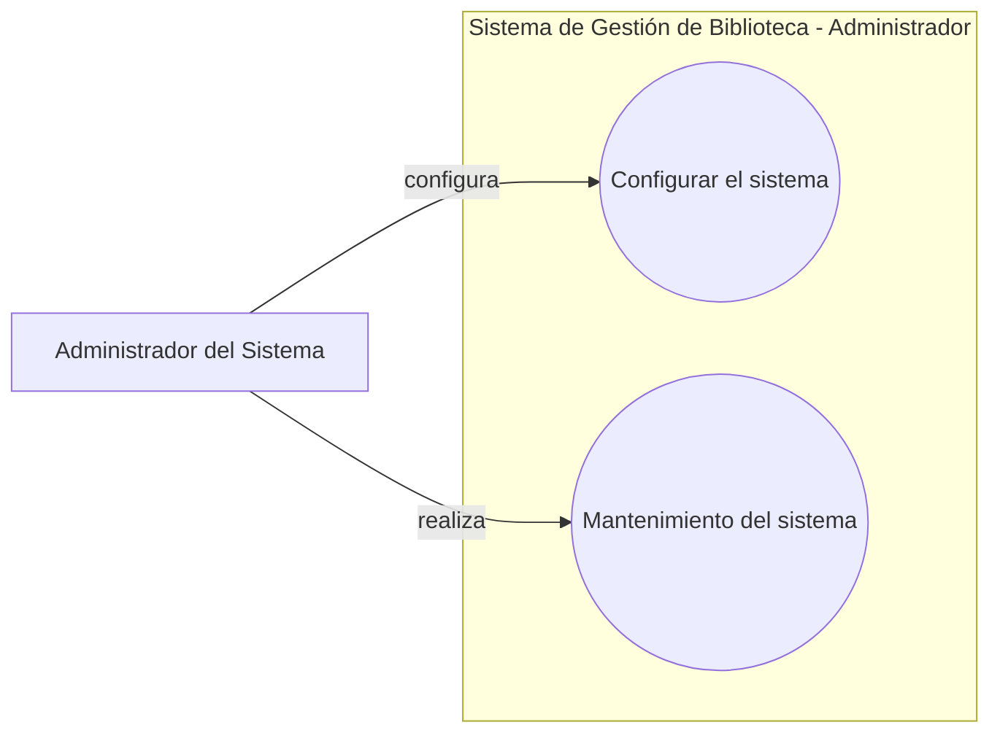
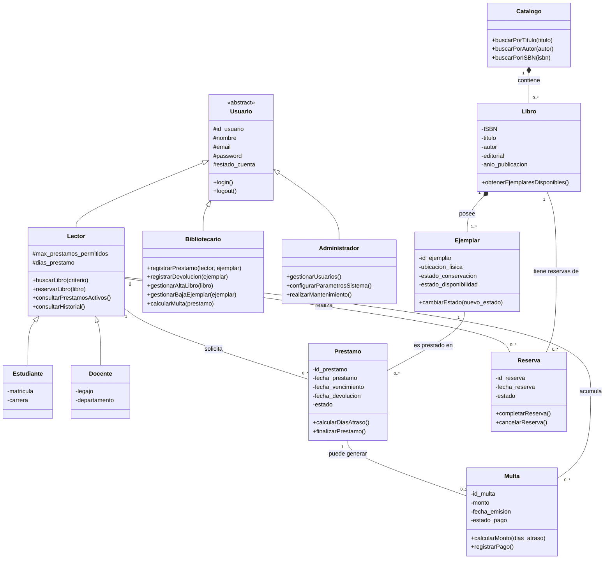
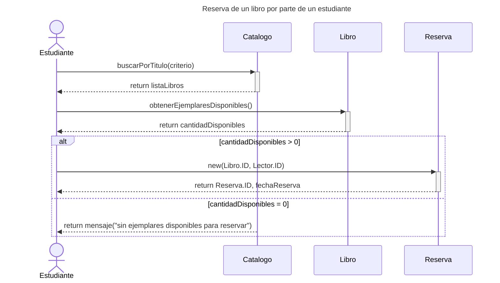
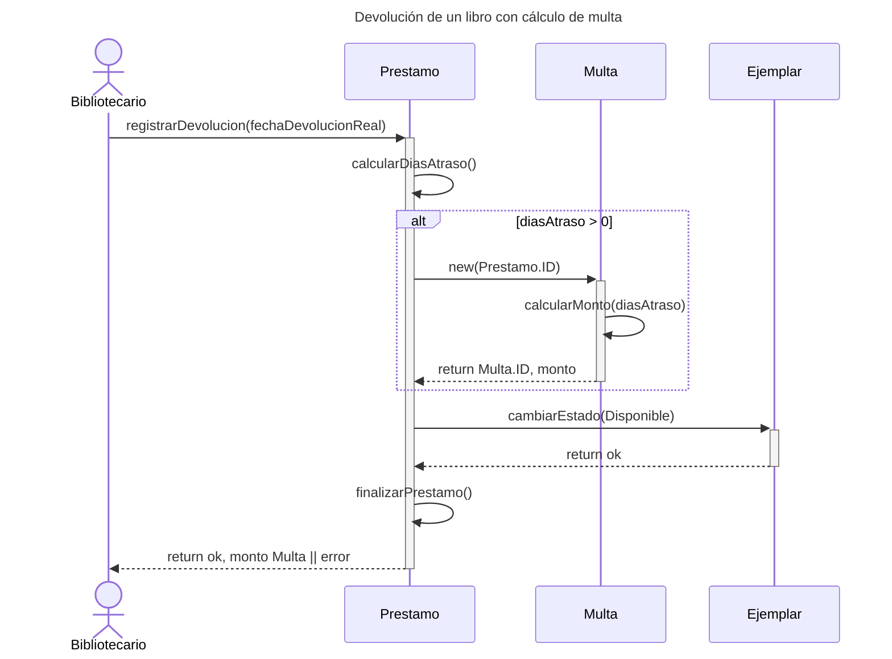
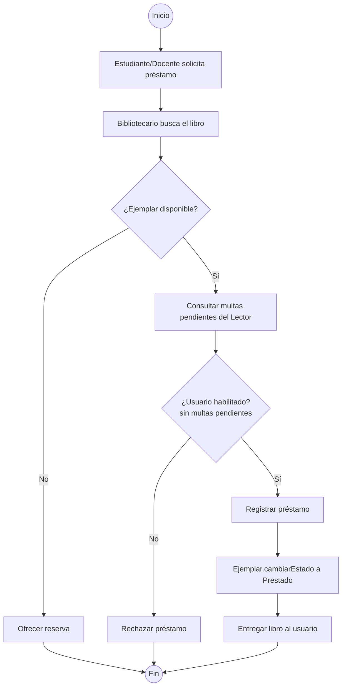
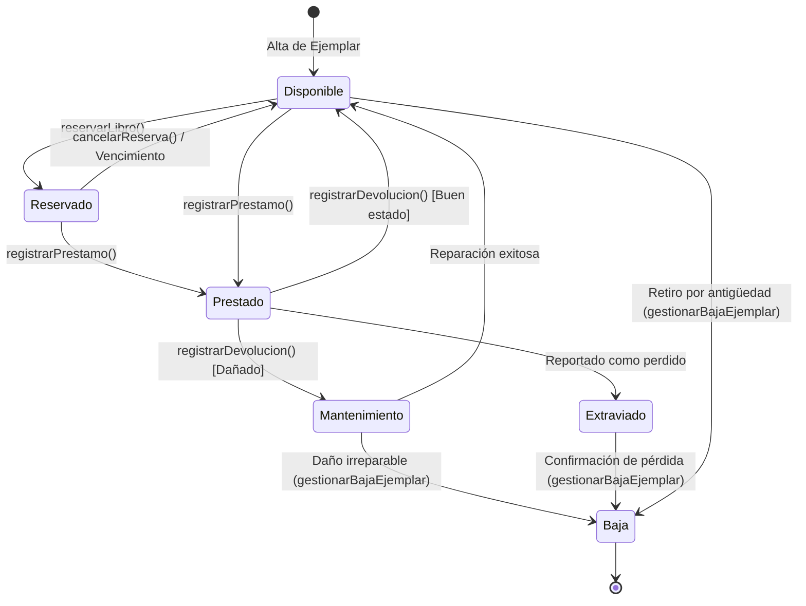

# Diagramas de casos de uso — Sistema de Gestión de Biblioteca 

### Lectores (Estudiante y Docente)

### Bibliotecario

### Administrador del Sistema

## Diagrama de Clases: Sistema de Gestión de Biblioteca

# Diagrama de secuencia — Reserva de un libro por parte de un estudiante 

# Diagrama de secuencia — Devolución de un libro con cálculo de multa 

# Diagrama de actividad — Préstamo de un libro

## Diagrama de Estados: Ciclo de vida de un Libro (Ejemplar)

